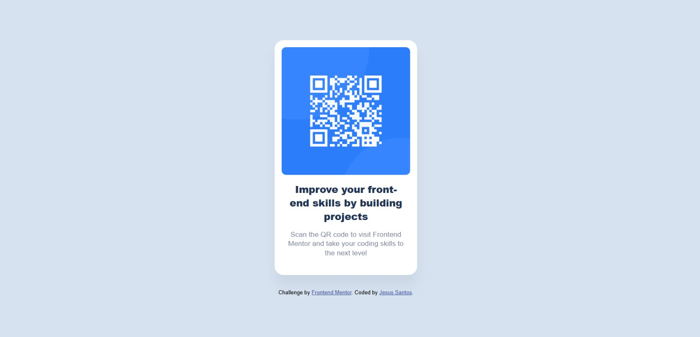

# Frontend Mentor - Solución del Componente de Código QR

Esta es una solución al [Desafío del Componente de Código QR en Frontend Mentor](https://www.frontendmentor.io/challenges/qr-code-component-iux_sIO_H).

## Tabla de contenidos

- [Resumen](#resumen)
  - [El desafío](#el-desafío)
  - [Captura de pantalla](#captura-de-pantalla)
  - [Enlaces](#enlaces)
- [Mi proceso](#mi-proceso)
  - [Construido con](#construido-con)
  - [Lo que aprendí](#lo-que-aprendí)
  - [Desarrollo continuo](#desarrollo-continuo)
- [Autor](#autor)

## Resumen

### El desafío

Los usuarios deben ser capaces de:

- Ver el diseño óptimo para el componente según el tamaño de pantalla de su dispositivo.

### Captura de pantalla



### Enlaces

- **URL del Repositorio:** [GitHub](https://github.com/tu-usuario/tu-repo-qr)
- **URL del Sitio en Vivo:** [GitHub Pages](https://tu-usuario.github.io/tu-repo-qr/)

## Mi proceso

### Construido con

- Marcado semántico HTML5 (usando `<main>` y `<footer>`)
- Propiedades personalizadas de CSS (Variables)
- **Flexbox** (para el centrado vertical y horizontal)
- Flujo de trabajo "Mobile-First"
- Unidades **`rem`** para un diseño escalable

### Lo que aprendí

Mi mayor aprendizaje en este proyecto fue la importancia de la **depuración (debugging) de CSS** y cómo un pequeño error puede romper un diseño completo.

Mi tarjeta no se centraba y no entendía por qué, a pesar de que mi código de `display: flex` en el `body` era 100% correcto.

El error era una sola línea en mi clase `.card`:

```css
.card {
  /* ... */
  max-width: 350rem; /* <-- ¡EL ERROR! */
  /* ... */
}
```

Este error de tipeo (en lugar del correcto `max-width: 20rem;`) hacía que la tarjeta fuera miles de píxeles más ancha que la pantalla, por lo que parecía que no estaba centrada. Esto me enseñó a usar la herramienta de inspección del navegador y a revisar las unidades de CSS con mucho cuidado.

Además, reforcé mi conocimiento sobre las **rutas de archivos**, asegurándome de quitar el `../` de mis enlaces de imágenes (`src="images/image-qr-code.png"`) para que funcionaran correctamente en el repositorio raíz.

### Desarrollo continuo

Quiero seguir solidificando mis fundamentos de maquetación en CSS, especialmente con Flexbox y CSS Grid. El siguiente paso en mi ruta de aprendizaje es empezar a añadir interactividad real a estos proyectos usando `JavaScript`.

### Autor
Frontend Mentor - [@jesussantos210](https://www.frontendmentor.io/profile/jesussantos210)